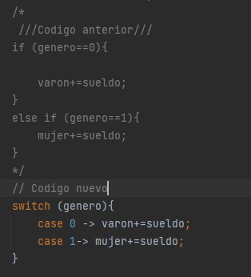

# Practica 4 - Investigación sobre trabajo colaborativo

Esta práctica se realizará por parejas, pero ambos alumnos deberán de entregar el PDF en aules. Se va a trabajar la colaboración en proyectos mediante GitHub.

**Nombre Alumno1: Brais Fernández Bouza**

**Nombre Alumno2: Aitor Agulló Duque**

URL del repositorio: https://github.com/BraisFernandezBouza/LaboratorioColaborarr.git

El alumno 1 deberá rellenar los apartados que aparece A1, y el alumnos 2 en A2.  
Las imágenes y este mismo archiuvo con su versión PDF deberán estar en GitHub.

1. A1: Cread un repositorio "laboratorioColaborar" en GitHub (Ponedlo público).

    
2. A2: Investigad sobre como utilizar GIT desde IntelliJ para explicarlo a A1.
3. A1: Subid una práctica de "Programación" desde IntelliJ

    
4. A2: Descargad el repositorio de A1.

5. A2: Haced modificaciones en el código y subidlo mediante IntelliJ.

6. A1: Descarga el programa actual y modifica una parte.

7. A2: Modifica la misma parte que A1 de manera que surja un coinflicto

8. A1 y A2 : Subid los cambios y resolved el conflicto.

9. A1:Investigad sobre la herramienta "CodeWithMe". 

Code with me es una nueva funcionalidad que JetBrains ha traído como novedad para IntelliJ recientemente. Se trata de un plugin que nos permite hacer pair programming con más de un compañero/a, como si estuviésemos escribiendo en Google Docs, de forma colaborativa.

10. A2: Investigad sobre la herramienta "GitHubCopilot".

GitHub Copilot es una herramienta de inteligencia artificial basada en la nube desarrollada por GitHub y OpenAI para ayudar y asistir a los usuarios de Visual Studio Code, Visual Studio, Neovim y los entornos de desarrollo integrado de JetBrains mediante el autocompletado de código.

Proyecto GIT: https://github.com/BraisFernandezBouza/LaboratorioColaborarr.git
(El trabajo se encuentra en la rama master)

Vídeos de ayuda:  
Subir proyecto desde GIT: https://www.youtube.com/watch?v=6WtA2dUDvPY  
Clonar repositorio: https://www.youtube.com/watch?v=rcQBgm5vid0
Colaborar con GIT: https://www.youtube.com/watch?v=ibmQkhAzk5I  

